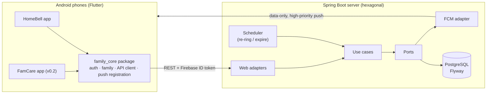

# FamCare

Two small Android apps that solve real problems for my family, sharing one Spring Boot backend:

| App | Problem | Status |
|---|---|---|
| **HomeBell** | Our gate is far from the house and usually locked, so nobody hears when someone arrives, and they end up waiting outside. | **v0.1: in progress** |
| **FamCare** | Everyone has daily vitamins to take, and it's easy to forget or lose track of who has taken theirs. | Planned (v0.2) |

Built with **Flutter** (Android), **Java 21 + Spring Boot 4**, **PostgreSQL**, and **Firebase**
(Authentication + Cloud Messaging), using the same **hexagonal architecture** as
[JobLens](https://github.com/dev-codewitheli/joblens).

> Privacy by design: the server stores a nickname and an auth id per person, nothing else.
> The public demo uses made-up data.

---

## HomeBell: ring the family from the gate

1. Tap **"I'm at the gate"**.
2. Every other family phone **rings like an incoming call**: a full-screen alert over the lock
   screen, alarm sound (it plays even when the phone is on silent), and vibration that repeats
   until someone answers.
3. Someone taps **"Coming!"** and the person at the gate sees *"Papa is coming!"*.
4. If nobody answers, it rings again every 30 s, up to 4 times, then tells the sender
   *"Nobody answered, try calling."*

### Why it's reliable (the interesting part)

- **Data-only, high-priority FCM pushes** wake phones in Doze, and the app decides how to
  present them. A regular notification push would show quietly instead of ringing.
- **Alarm-grade notifications**: a dedicated channel with `USAGE_ALARM` audio, `FLAG_INSISTENT`
  looping, a full-screen intent, and `showWhenLocked`/`turnScreenOn` on the activity.
- **Server-side re-ring and expiry** (a Spring `@Scheduled` job) means a missed push doesn't leave
  someone stuck at the gate.
- **A reliability checklist** in the app fixes what silently breaks pushes on Android:
  notification permission, full-screen intent permission (Android 14+), battery optimization,
  and step-by-step tips for the brands that kill background apps (Xiaomi, Oppo, Vivo, Realme,
  Infinix, and others). The native checks live in a small Kotlin `MethodChannel`.

## Architecture



```
famcare/
├── apps/homebell/          Flutter app: gate alerts
├── packages/family_core/   Shared Flutter package: sign-in, family groups, API client
├── server/                 Spring Boot API: domain → application (ports) → adapters
└── pubspec.yaml            Dart pub workspace (one lockfile for all Flutter projects)
```

## Run it locally (demo mode: no Firebase needed)

**Requirements:** JDK 21, Flutter 3.44+, Android Studio with an emulator.

```bash
# 1. Server (in-memory H2, demo auth, pushes logged to the console)
cd server
./gradlew bootRun

# 2. App, on an Android emulator (reaches the host at 10.0.2.2:8080)
cd apps/homebell
flutter run
```

Sign in with any demo id (e.g. `papa`), create a family, then run a second emulator, sign in
as `ate`, and join with the invite code. In demo mode the app polls every 3 s instead of using
push, so try ringing from one emulator and answering from the other.

## Run it for real (Firebase + PostgreSQL)

- [docs/SETUP.md](docs/SETUP.md): create the Firebase project and enable Google sign-in.
- [docs/DEPLOY.md](docs/DEPLOY.md): deploy the server to Render with Neon PostgreSQL, then build
  the signed release APK.

## Tests

```bash
cd server && ./gradlew test                 # domain rules + full HTTP flow on H2
cd packages/family_core && flutter test     # API client
cd apps/homebell && flutter test            # gate state machine
```

## Roadmap

See [docs/ROADMAP.md](docs/ROADMAP.md).
