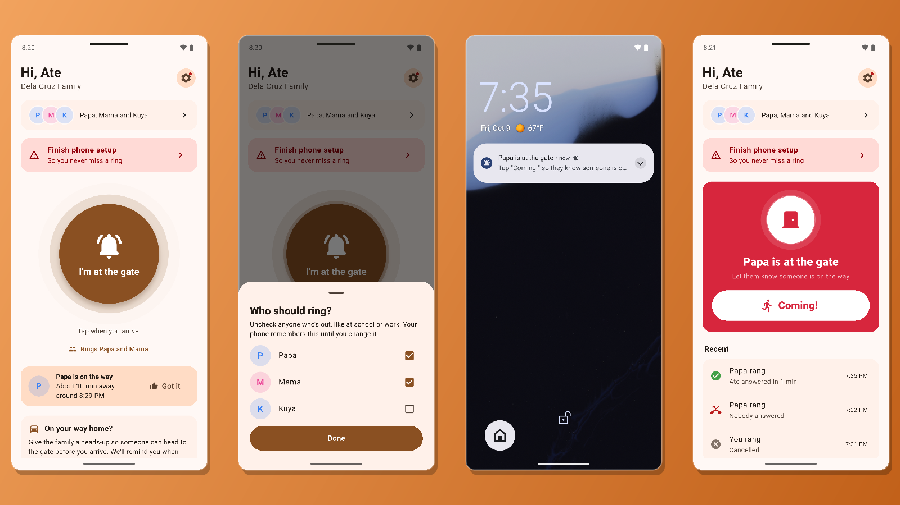
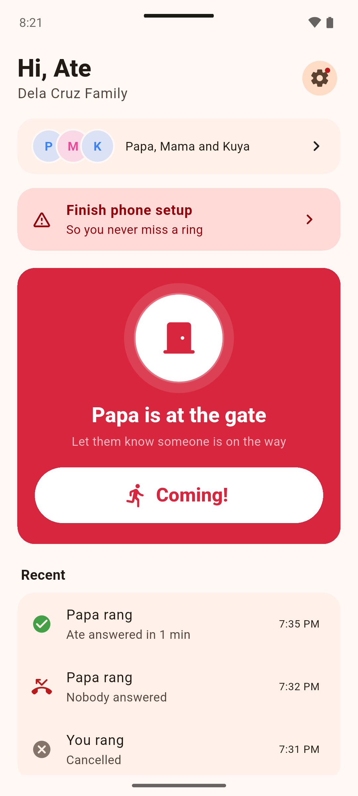
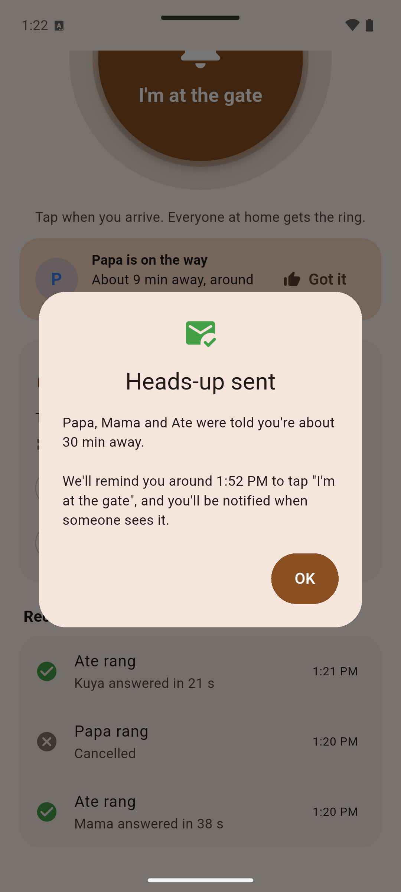
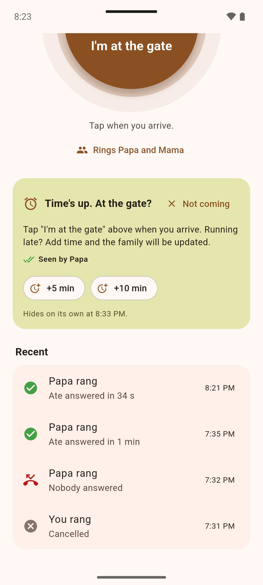
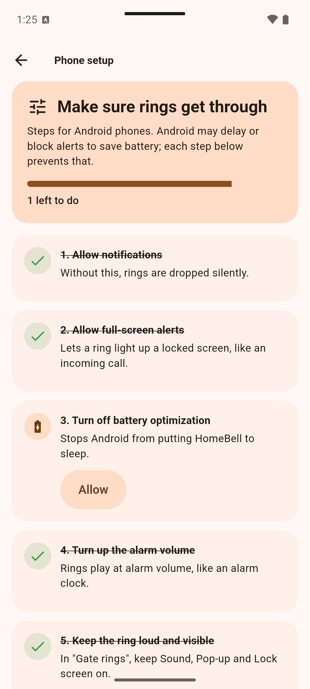
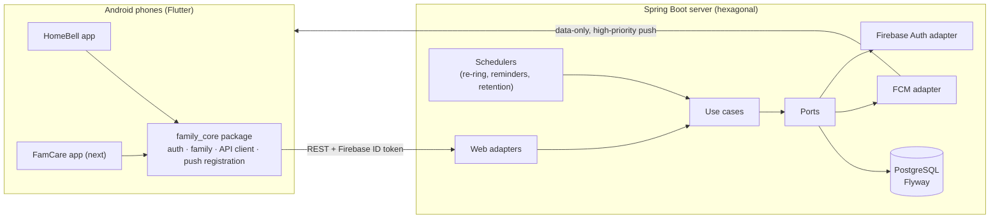

# FamCare

Android apps that solve real problems for my family, sharing one Spring Boot backend.



| App | Problem | Status |
|---|---|---|
| **HomeBell** | Our gate is far from the house and usually locked, so nobody hears when someone arrives, and they end up waiting outside. | **In daily use** · [Download the APK](https://github.com/dev-codewitheli/famcare/releases/latest) |
| **FamCare** | Everyone has daily vitamins to take, and it's easy to forget or lose track of who has taken theirs. | Next |

Built with **Flutter** (Android) + a little **Kotlin**, **Java 21 + Spring Boot 4**,
**PostgreSQL**, and **Firebase** (Authentication, Cloud Messaging, Crashlytics), using the same
**hexagonal architecture** as [JobLens](https://github.com/dev-codewitheli/joblens).

> **Privacy by design:** the server stores a nickname and a random sign-in ID per person, and
> deletes gate activity after 90 days. Screenshots use a made-up family.
> [Privacy policy](https://dev-codewitheli.github.io/homebell/privacy.html)

---

## HomeBell: ring the family from the gate

1. Tap **"I'm at the gate"**. It rings everyone, or only the people you pick (say, not whoever
   is at school or work); your phone remembers the choice.
2. Their phones **ring like an incoming call**: the screen wakes with an alarm sound and
   vibration, repeating until someone answers. Locked phones stay locked.
3. Someone taps **"Coming!"**, right from the lock-screen notification, and the person at the
   gate sees *"Papa is coming!"*.
4. If nobody answers, it rings again every 30 s, up to 4 times, then tells the sender
   *"Nobody answered, try calling."*

**Not home yet?** Send an **"On my way (~5/10/15/30 min)"** heads-up. The family can tap
**Got it** (you see *"Seen by Papa"*), and when your time is up HomeBell asks **"At the gate?"**
with **+5 / +10 min** or **Not coming**.

Also: recent activity, editable nicknames, family management (rename, remove members, new
invite code, leave), in-app account deletion, and an optional per-phone
**"Ring even on Silent / Do Not Disturb"**.

| Ringing | Heads-up sent | Time's up | Phone setup |
|---|---|---|---|
|  |  |  |  |

### Why it's reliable (the interesting part)

- **Data-only, high-priority FCM pushes** wake phones in Doze, and the app decides how to
  present them. A regular notification push would show quietly instead of ringing.
- **Alarm-grade notifications**: a dedicated channel with `USAGE_ALARM` audio, `FLAG_INSISTENT`
  looping, and a full-screen intent that wakes the screen while the phone stays locked. "Coming!"
  runs in a background isolate (no unlock needed), and opening the app doesn't stop the ring;
  only "Coming!" does.
- **Server-side scheduling** (Spring `@Scheduled`): re-rings and expiry, "time's up" reminders,
  and nightly data retention, so a missed push never leaves someone stuck at the gate.
- **Per-brand phone setup** for Xiaomi, OPPO/OnePlus, realme, vivo, Samsung and Infinix/Tecno:
  deep links to the hidden autostart, lock-screen and battery screens, and automatic checks where
  possible (including Xiaomi's app-ops via a small Kotlin `MethodChannel`), so there's nothing
  to confirm by hand that the phone can verify itself.

## Architecture



```
famcare/
├── apps/homebell/          Flutter app: gate alerts (+ Kotlin for OEM settings and checks)
├── packages/family_core/   Shared Flutter package: sign-in, family groups, API client, theme
├── server/                 Spring Boot API: domain → application (ports) → adapters
└── pubspec.yaml            Dart pub workspace (one lockfile for all Flutter projects)
```

## Run it locally (demo mode: no Firebase needed)

**Requirements:** JDK 21, Flutter 3.44+, Android Studio with an emulator.

```bash
# 1. Server (in-memory H2, demo auth, pushes logged to the console)
cd server
./gradlew bootRun

# 2. App, on an Android emulator (reaches the host at 10.0.2.2:8080)
cd apps/homebell
flutter run
```

Sign in with any demo id (e.g. `papa`), create a family, then run a second emulator, sign in
as `ate`, and join with the invite code. In demo mode the app polls every 3 s instead of using
push, so try ringing from one emulator and answering from the other.

## Run it for real

- [docs/SETUP.md](docs/SETUP.md): create the Firebase project and enable Google sign-in.
- [docs/DEPLOY.md](docs/DEPLOY.md): deploy the server to Render with Neon PostgreSQL.
- [docs/RELEASING.md](docs/RELEASING.md): tag a version; GitHub Actions builds the signed APKs
  and publishes a release.

## Tests

```bash
cd server && ./gradlew test                 # domain rules + full HTTP flows on H2
cd packages/family_core && flutter test     # API client
cd apps/homebell && flutter test            # gate state, heads-ups, per-brand setup
```

## Roadmap

See [docs/ROADMAP.md](docs/ROADMAP.md).
